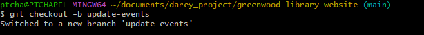
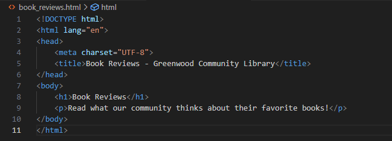

# Greenwood Community Library Website
## Overview
This project enhances the Greenwood Community Library website by adding a "Book Reviews" section and updating the "Events" page using Git for version control.

## Contributors
Morgan
Jamie

## Steps Taken

### 1. Repository Setup
- Created a repository named greenwood-library-website on GitHub with a README.md file.  
  

- Cloned the repository to my local machine:  
  ```bash
  git clone https://github.com/endrissuofe/greenwood-library-website.git
  cd greenwood-library-website
 

 ### 2. Initial Website Files
- Created home.html, about_us.html, events.html, and contact_us.html with basic content in the main branch.  
  

- Staged, committed, and pushed the files to main:  
  ```bash
  git add .
  git commit -m "Add initial website files: home, about_us, events, contact_us"
  git push origin main


 ### 3. Adding Book Reviews Section
- Created a new branch add-book-reviews:  
  ```bash
  git checkout -b add-book-reviews
 

- Added book-review with content


- Staged, committed, and pushed the changes:
  ```bash
  git add book_reviews.html
  git commit -m "Add book reviews section"
  git push origin add-book-reviews

 
 - Created a pull request for add-book-reviews on GitHub
 
 - Merged the pull request into main
 

4. Updating Events Page

- Created a new branch update-events:
  ```bash
  git checkout -b update-events
 
- Updated events.html with upcoming events.Updated Events File
  
- Pulled the latest changes from main to avoid conflicts
  ```bash
  git pull origin main
 
- Staged, committed, and pushed the changes:
  ```bash
  git add events.html
  git commit -m "Update events page with upcoming events"
  git push origin update-events
 
- Created a pull request for update-events on GitHub.
 
 Merged the pull request into main
 